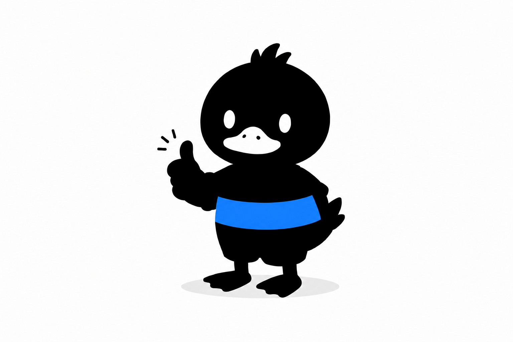

# 黑鸭 - dark duck

## 项目简介

黑鸭（dark duck）是一个专注于健身训练的在线平台，旨在为用户提供科学、系统的健身指导和资源。无论你是健身新手还是有经验的运动爱好者，黑鸭都能帮助你制定个性化的训练计划，提供专业的教学视频和实用的健身工具推荐，让你的健身之路更加高效和愉快。

## 主要功能

- **个性化训练计划**：根据用户的健身目标、身体状况和时间安排，智能生成适合的训练计划。
- **专业教学视频**：提供高质量的健身教学视频，涵盖各种训练类型和难度级别，帮助用户正确掌握动作要领。
- **健身工具推荐**：根据用户的训练需求，推荐实用的健身工具和装备，提升训练效果和安全性。
- **社区交流**：用户可以在社区中分享训练心得、交流经验，互相鼓励，共同进步。

## 技术栈

- 前端：HTML、CSS、JavaScript
- 后端：None(暂无)
- AI集成：使用AI模型提供智能训练计划和解答用户问题
  
## 未来计划

- 增加更多训练类型和教学视频，满足不同用户的需求
- 引入更多AI功能，如智能饮食建议和训练数据分析
- 开发移动端应用，提供更便捷的使用体验
- 建立更活跃的社区，促进用户之间的交流和互动